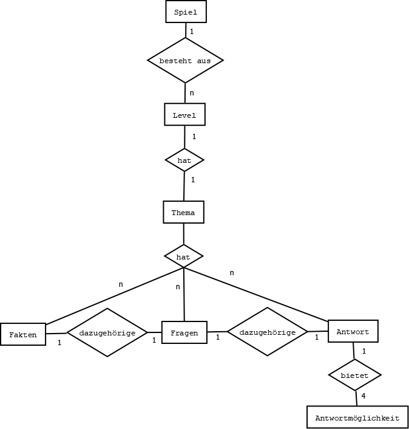

# Spielname: Bürgermeister Run

Version 1

# Spielkonzept

## Idee

Bei dem Spiel „Bürgermeister Run&quot; handelt es sich um ein klassisches „Jump and Run&quot;, bei dem der Spieler beim Spielen der Level thematisch gebundene Inhalte zur Stadt Wiesbaden erlernen soll.

Ziel des Spielers ist es die Level abzuschließen dabei gibt allerdings, im Gegensatz zu einem normalen Jump and Run, zwei Hürden:

1. Man muss das Level beenden ohne zu sterben
2. Man muss am Ende des Levels Fragen beantworten um das nächste Level freizuschalten

Zur 1: Der Spieler stirbt, wenn er aus der Map fällt, oder von einem Gegner getroffen wird. Damit nicht jede Berührung zum Tod führt, bekommt der Spieler vor jedem Level drei Leben. Sollte der Spieler von einem Gegner getroffen werden verliert er ein Leben, wenn er 0 Leben erreicht hat, gilt das Level als verloren und der Spieler muss das Level neustarten. Die Leben retten den Spieler nicht vor dem Fallen der Map. Fällt der Spieler aus der Map muss er das Level neustarten oder von einem Checkpoint aus weiter spielen. Sollte der Spieler von einem Checkpoint aus weiterspielen, bekommt er für das Fallen ein Leben abgezogen.

Zur 2: Am Ende des Levels muss der Spieler Fragen zur Stadt beantworte. Die Antworten zu den Fragen sind in den Levels verteilt. Dabei bilden Kisten (ähnlich wie bei Mario die  Fragezeichen-Kisten) Fakten ab, wenn der Spieler gegen die Kiste springt. Diese Fakten beinhalten die Antworten um am Ende des Levels die Fragen zu beantworten. Es werden je 5 Fragen gestellt mit je 4 Antwortmöglichkeiten. Der Spieler hat bei der Beantwortung der Fragen immer 2 Möglichkeiten. Beantwortet der Spieler eine Frage zweimal falsch, so muss er das Level erneut spielen und es werden neue Fakten und Fragen generiert.

## Themen

Jedes Level gehört einem bestimmten Thema an. Das erste Level könnte beispielweiße vom Neroberg handeln. Dabei ist das Level dem Thema angepasst, d. h. das Level würde einer Berglandschaft ähneln. Die Fakten und die dazu passenden Fragen mit den dazugehörigen möglichen Antworten werden vor jedem Spiel zufällig vom System gewählt, passen aber immer zum Thema.

Die Fakten, Fragen und Antworten können vom Admin dem Spiel hinzugefügt werden.

## Steuerung

Die Steuerung erfolgt über die Pfeiltasten, während die linke und rechte Pfeiltaste angeben in welche Richtung sich der Spieler bewegt, kann man mit der oben Pfeiltaste springen und sich mit der unteren Pfeiltaste bücken.

## Modell

